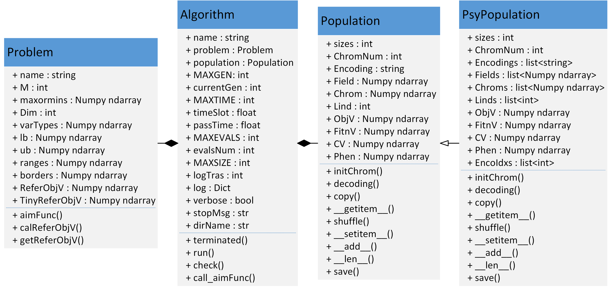

# **Geatpy2**

The Genetic and Evolutionary Algorithm Toolbox for Python with high performance.

[](https://github.com/geatpy-dev/geatpy/actions)
[](https://pypi.org/project/geatpy/)
[](https://pypi.org/project/geatpy/)
[](https://pypi.org/project/geatpy/)
[](https://pypi.python.org/pypi/geatpy)
[](https://github.com/geatpy-dev/geatpy/blob/master/LICENSE)
[](https://gitter.im/geatpy2/community?utm_source=badge&utm_medium=badge&utm_campaign=pr-badge)

## Introduction

* **Website (including documentation)**: <http://www.geatpy.com>
* **Demo** : <https://github.com/geatpy-dev/geatpy/tree/master/demo>
* **Pypi page** : <https://pypi.org/project/geatpy/>
* **Contact us**: <http://geatpy.com/index.php/about/>
* **Bug reports**: <https://github.com/geatpy-dev/geatpy/issues>
* **Notice**: <http://geatpy.com/index.php/notice/>
* **FAQ**: <http://geatpy.com/index.php/faq/>

The features of Geatpy:

* Capability of solving single-objective, multi-objectives, many-objectives and combinatorial optimization problems fast.
* A huge number of operators with high performance of evolutionary algorithms (selection, recombination, mutation, migration...).
* Support numerous encodings for the chromosome of the population.
* Many evolutionary algorithm templates, including GA, DE, ES for single/multi-objective(s) evolution.
* Multiple population evolution.
* Support polysomy evolution.
* Parallelization and distribution of evaluations.
* Testbeds containing most common benchmarks functions.
* Support tracking analysis of the evolution iteration.
* Many evaluation metrics of algorithms.

## Improvement of Geatpy 2.7.0

* Add a new way to define the aim function of the problem.
* Support calculating objectives and constraints for the variables of only one individual.
* Add a optimize function to do the optimization more convenient.
* Add new open-source plotting functions.
* Remove the dependency on scipy.
* A new and faster core.

## Installation

### From PyPI

```bash
pip install geatpy
```

This is the recommended installation method.

### From source

Download or clone the project from the repository and run the following commands:

```bash
pip install -r requirement.txt
python setup.py install
```

**Note**: Since the only binary requirements of Python 3.6 of Windows x64 and Linux x64 are included in the repository,
the following installation method is only appliable for these Python version and platforms.

### From wheel

Download the wheel file for your Python version and platform from <https://github.com/geatpy-dev/geatpy/releases>.

```bash
pip install <filename>.whl
```

## Versions

**Geatpy** must run under **Python** 3.5, 3.6, 3.7, 3.8, 3.9, or 3.10 in Windows x32/x64, Linux x64 or MacOS x64.

There are different versions for **Windows**, **Linux** and **Mac**, you can download them from <http://geatpy.com/>

The version of **Geatpy** on github is the latest version suitable for **Python** >= 3.5

You can also **update** Geatpy by executing the command:

```bash
pip install --upgrade geatpy
```

If something wrong happened, such as decoding error about 'utf8' of pip, run this command instead or execute it as an administrator:

```bash
pip install --upgrade --user geatpy
```

## Quick start

Here is the UML figure of Geatpy2.



For solving a multi-objective optimization problem, you can use **Geatpy** mainly in two steps:

1.Write down the aim function and some relevant settings in a derivative class named **MyProblem**, which is inherited from **Problem** class:

```python
"""MyProblem.py"""
import numpy as np
import geatpy as ea
class MyProblem(ea.Problem): # Inherited from Problem class.
    def __init__(self, M): # M is the number of objects.
        name = 'DTLZ1' # Problem's name.
        maxormins = [1] * M # All objects are need to be minimized.
        Dim = M + 4 # Set the dimension of decision variables.
        varTypes = [0] * Dim # Set the types of decision variables. 0 means continuous while 1 means discrete.
        lb = [0] * Dim # The lower bound of each decision variable.
        ub = [1] * Dim # The upper bound of each decision variable.
        lbin = [1] * Dim # Whether the lower boundary is included.
        ubin = [1] * Dim # Whether the upper boundary is included.
        # Call the superclass's constructor to complete the instantiation
        ea.Problem.__init__(self, name, M, maxormins, Dim, varTypes, lb, ub, lbin, ubin)
    def aimFunc(self, pop): # Write the aim function here, pop is an object of Population class.
        Vars = pop.Phen # Get the decision variables
        XM = Vars[:,(self.M-1):]
        g = np.array([100 * (self.Dim - self.M + 1 + np.sum(((XM - 0.5)**2 - np.cos(20 * np.pi * (XM - 0.5))), 1))]).T
        ones_metrix = np.ones((Vars.shape[0], 1))
        pop.ObjV = 0.5 * np.fliplr(np.cumprod(np.hstack([ones_metrix, Vars[:,:self.M-1]]), 1)) * np.hstack([ones_metrix, 1 - Vars[:, range(self.M - 2, -1, -1)]]) * np.tile(1 + g, (1, self.M))
    def calReferObjV(self): # Calculate the theoretic global optimal solution here.
        uniformPoint, ans = ea.crtup(self.M, 10000) # create 10000 uniform points.
        realBestObjV = uniformPoint / 2
        return realBestObjV
```

2.Instantiate **MyProblem** class and a derivative class inherited from **Algorithm** class in a Python script file "main.py" then execute it. **For example**, trying to find the pareto front of **DTLZ1**, do as the following:

```python
"""main.py"""
import geatpy as ea # Import geatpy
from MyProblem import MyProblem # Import MyProblem class
if __name__ == '__main__':
    M = 3                      # Set the number of objects.
    problem = MyProblem(M)     # Instantiate MyProblem class
    # Instantiate a algorithm class.
    algorithm = ea.moea_NSGA3_templet(problem,
                                      ea.Population(Encoding='RI', NIND=100),  # Set 100 individuals.
                                      MAXGEN=500,  # Set the max iteration number.
                                      logTras=1)  # Set the frequency of logging. If it is zero, it would not log.
    # Do the optimization
    res = ea.optimize(algorithm, verbose=False, drawing=1, outputMsg=True, drawLog=True, saveFlag=True)

```

Run the "main.py" and the part of the result is:


Execution time: 0.3650233745574951 s

Evaluation number: 45500

The number of non-dominated solutions is: 91

gd: 0.00033

igd: 0.02084

hv: 0.84061

spacing: 0.00158

For solving another problem: **Ackley-30D**, which has only one object and 30 decision variables, what you need to do is almost the same as above.

1.Write the aim function in "MyProblem.py".

```python
import numpy as np
import geatpy as ea
class Ackley(ea.Problem): # Inherited from Problem class.
    def __init__(self, D = 30):
        name = 'Ackley' # Problem's name.
        M = 1 # Set the number of objects.
        maxormins = [1] * M # All objects are need to be minimized.
        Dim = D # Set the dimension of decision variables.
        varTypes = [0] * Dim # Set the types of decision variables. 0 means continuous while 1 means discrete.
        lb = [-32.768] * Dim # The lower bound of each decision variable.
        ub = [32.768] * Dim # The upper bound of each decision variable.
        lbin = [1] * Dim # Whether the lower boundary is included.
        ubin = [1] * Dim # Whether the upper boundary is included.
        # Call the superclass's constructor to complete the instantiation
        ea.Problem.__init__(self, name, M, maxormins, Dim, varTypes, lb, ub, lbin, ubin)
    def aimFunc(self, pop): # Write the aim function here, pop is an object of Population class.
        x = pop.Phen # Get the decision variables
        n = self.Dim
        f = np.array([-20 * np.exp(-0.2*np.sqrt(1/n*np.sum(x**2, 1))) - np.exp(1/n * np.sum(np.cos(2 * np.pi * x), 1)) + np.e + 20]).T
        return f, CV
    def calReferObjV(self): # Calculate the global optimal solution here.
        realBestObjV = np.array([[0]])
        return realBestObjV
```

2.Write "main.py" to execute the algorithm templet to solve the problem.

```python
import geatpy as ea # import geatpy
import numpy as np
from MyProblem import Ackley
if __name__ == '__main__':
    # Instantiate MyProblem class.
    problem = Ackley(30)
    # Instantiate a algorithm class.
    algorithm = ea.soea_DE_rand_1_bin_templet(problem,
                                              ea.Population(Encoding='RI', NIND=20),
                                              MAXGEN=1000,  # Set the max times of iteration.
                                              logTras=1)  # Set the frequency of logging. If it is zero, it would not log.
    algorithm.mutOper.F = 0.5  # Set the F of DE
    algorithm.recOper.XOVR = 0.2  # Set the Cr of DE (Here it is marked as XOVR)
    # Do the optimization
    res = ea.optimize(algorithm, verbose=False, drawing=1, outputMsg=True, drawLog=True, saveFlag=True, dirName='result')
```

Part of the result is:


Execution time: 0.256328821182251 s

Evaluation number: 20000

The best objective value is: 3.209895993450118e-08

To get more tutorials, please link to <http://www.geatpy.com>.

## Contributing

Welcome to submit issues, pull requests to this project.
The required binary `pyd` files are included in the repository only for Python 3.6 in Windows/Linux x64 platform.
The binary files of other Python version and platforms will be published in the future.
Therefore, you need to develop in Python 3.6 in Windows/Linux x64.

Clone the reposity and run the following commands:

```bash
pip install -r dev-requirements.txt
python setup.py build
```

These commands install the required dependencies and automatically copy the required binary files to the package folder.

To ensure the code quality, please install the pre-commit hooks:

```bash
pre-commit install -t pre-commit -t commit-msg
```

We recommand you to

* Use [pre-commit](https://github.com/commitizen-tools/commitizen) and [commitizen](https://github.com/commitizen-tools/commitizen) to submit commits.
* Use [flake8](https://github.com/PyCQA/flake8), [yapf](https://github.com/google/yapf), and [isort](https://github.com/PyCQA/isort) to format your codes.
* Follow [gitflow](https://github.com/petervanderdoes/gitflow-avh) branch manage strategies.
